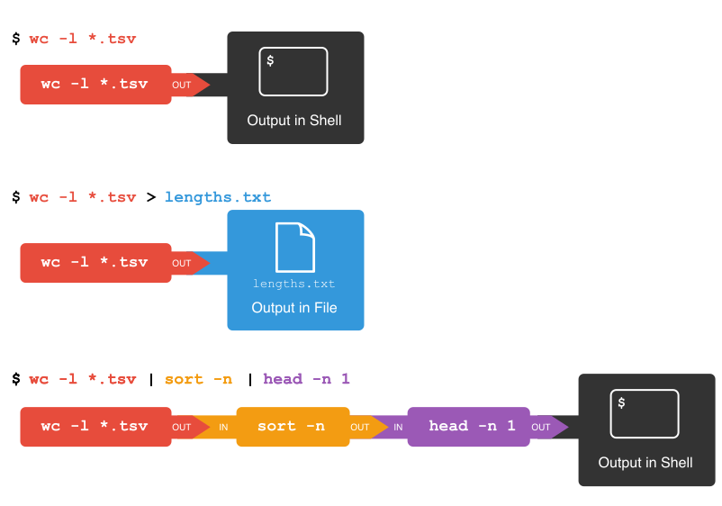

##  Counting and mining data

Now that you know how to navigate the shell, we will move onto
learning how to count and mine data using a few of the standard shell commands.
While these commands are unlikely to revolutionise your work by themselves,
they're very versatile and will add to your foundation for working in the shell
and for learning to code. The commands also replicate the sorts of uses library users might make of library data.

## Counting and sorting

We will begin by counting the contents of files using the Unix shell.
We can use the Unix shell to quickly generate counts from across files,
something that is tricky to achieve using the graphical user interfaces of standard office suites.

Let's start by navigating to the directory that contains our data using the
`cd` command:

~~~
$ cd shell-lesson
~~~
{: .bash}

Remember, if at any time you are not sure where you are in your directory structure,
use the `pwd` command to find out:

~~~
$ pwd
~~~
{: .bash}
~~~
/Users/riley/Desktop/shell-lesson
~~~
{: .output}

And let's just check what files are in the directory and how large they
are with `ls -lhS`:

~~~
$ ls -lhS
~~~
{: .bash}
~~~
total 139M
-rw-rw-r-- 1 riley staff 126M Jun 10  2015 2014-01_JA.tsv
-rw-r--r-- 1 riley staff 7.4M Jan 31 18:47 2014-01-31_JA-america.tsv
-rw-r--r-- 1 riley staff 3.6M Jan 31 18:47 2014-01-31_JA-africa.tsv
-rw-r--r-- 1 riley staff 1.4M Jan 31 18:47 2014-02-02_JA-britain.tsv
-rw-r--r-- 1 riley staff 598K Jan 31 18:47 gulliver.txt
-rw-r--r-- 1 riley staff 583K Feb  1 22:53 33504-0.txt
drwxr-xr-x 2 riley staff   68 Feb  2 00:58 backup
~~~
{: .output}

In this episode we'll focus on the dataset `2014-01_JA.tsv`, that contains
journal article metadata, and the three `.tsv` files derived from the original
dataset. Each of these three `.tsv` files includes all data where a keyword such
as `africa` or `america` appears in the 'Title' field of `2014-01_JA.tsv`.

> ## CSV and TSV Files
> CSV (Comma-separated values) is a common plain text format for storing tabular
> data, where each record occupies one line and the values are separated by commas.
> TSV (Tab-separated values) is just the same except that values are separated by
> tabs rather than commas. Confusingly, CSV is sometimes used to refer to both CSV,
> TSV and variations of them. The simplicity of the formats make them great for
> exchange and archival. They are not bound to a specific program (unlike Excel
> files, say, there is no `CSV` program, just lots and lots of programs that
> support the format, including Excel by the way.), and you wouldn't have any
> problems opening a 40 year old file today if you came across one.
{: .callout}
<!-- hm, reminds me of MARC -->

First, let's have a look at the largest data file, using the tools we learned in
[Reading files]({{ page.root }}/03-working-with-files-and-folders.md/index.html#reading-files):

~~~
$ cat 2014-01_JA.tsv
~~~
{: .bash}

Like `829-0.txt` before, the whole dataset cascades by and can't really make any
sense of that amount of text. To cancel this on-going con`cat`enation, or indeed any
process in the Unix shell, press <kbd>Ctrl</kbd>+<kbd>C</kbd>.

In most data files a quick glimpse of the first few lines already tells us a lot
about the structure of the dataset, for example the table/column headers:

~~~
$ head -n 3 2014-01_JA.tsv
~~~
{: .bash}
~~~
File    Creator    Issue    Volume    Journal    ISSN    ID    Citation    Title    Place    Labe    Language    Publisher    Date
History_1a-rdf.tsv  Doolittle, W. E.  1 59  KIVA -ARIZONA-  0023-1940 (Uk)RN001571862 KIVA -ARIZONA- 59(1), 7-26. (1993)  A Method for Distinguishing between Prehistoric and Recent Water and Soil Control Features  xxu eng ARIZONA ARCHAEOLOGICAL AND HISTORICAL SOCIETY 1993
History_1a-rdf.tsv  Nelson, M. C. 1 59  KIVA -ARIZONA-  0023-1940 (Uk)RN001571874 KIVA -ARIZONA- 59(1), 27-48. (1993) Classic Mimbres Land Use in the Eastern Mimbres Region, Southwestern New Mexico xxu eng ARIZONA ARCHAEOLOGICAL AND HISTORICAL SOCIETY 1993

~~~
{: .output}

In the header, we can see the common metadata fields of academic papers: `Creator`, `Issue`, `Citation`, etc.

Next, let's learn about a basic data analysis tool:
`wc` is the "word count" command: it counts the number of lines, words, bytes
and characters in files. Since we love the wildcard operator, let's run the command
`wc *.tsv` to get counts for all the `.tsv` files in the current directory
(it takes a little time to complete):

~~~~
$ wc *.tsv
~~~~
{: .bash}
~~~
    13712    511261   3773660 2014-01-31_JA-africa.tsv
    27392   1049601   7731914 2014-01-31_JA-america.tsv
   507732  17606310 131122144 2014-01_JA.tsv
     5375    196999   1453418 2014-02-02_JA-britain.tsv
   554211  19364171 144081136 total
~~~
{: .output}

The first three columns contains the number of lines, words and bytes
(to show number characters you have to use a flag).

If we only have a handful of files to compare, it might be faster or more convenient
to just check with Microsoft Excel, OpenRefine or your favourite text editor, but
when we have tens, hundreds or thousands of documents, the Unix shell has a clear
speed advantage. The real power of the shell comes from being able to combine commands
and automate tasks, though. We will touch upon this slightly.

For now, we'll see how we can build a simple pipeline to find the shortest file
in terms of number of lines. We start by adding the `-l` flag to get only the
number of lines, not the number of words and bytes:

~~~~
$ wc -l *.tsv
~~~~
{: .bash}
~~~
    13712 2014-01-31_JA-africa.tsv
    27392 2014-01-31_JA-america.tsv
   507732 2014-01_JA.tsv
     5375 2014-02-02_JA-britain.tsv
   554211 total
~~~
{: .output}

The `wc` command itself doesn't have a flag to sort the output, but as we'll
see, we can combine three different shell commands to get what we want.

First, we have the `wc -l *.tsv` command. We will save the output from this
command in a new file. To do that, we *redirect* the output from the command
to a file using the ‘greater than’ sign (>), like so:

~~~
$ wc -l *.tsv > lengths.txt
~~~
{: .bash}

There's no output now since the output went into the file `lengths.txt`, but
we can check that the output indeed ended up in the file using `cat` or `less`
(or Notepad or any text editor).

~~~~
$ cat lengths.txt
~~~~
{: .bash}
~~~
    13712 2014-01-31_JA-africa.tsv
    27392 2014-01-31_JA-america.tsv
   507732 2014-01_JA.tsv
     5375 2014-02-02_JA-britain.tsv
   554211 total
~~~
{: .bash}

Next, there is the `sort` command. We'll use the `-n` flag to specify that we
want numerical sorting, not lexical sorting, we output the results into
yet another file, and we use `cat` to check the results:

~~~~
$ sort -n lengths.txt > sorted-lengths.txt
$ cat sorted-lengths.txt
~~~~
{: .bash}
~~~
     5375 2014-02-02_JA-britain.tsv
    13712 2014-01-31_JA-africa.tsv
    27392 2014-01-31_JA-america.tsv
   507732 2014-01_JA.tsv
   554211 total
~~~
{: .output}

Finally we have our old friend `head`, that we can use to get the first line
of the `sorted-lengths.txt`:

~~~~
$ head -n 1 sorted-lengths.txt
~~~~
{: .bash}
~~~
     5375 2014-02-02_JA-britain.tsv
~~~
{: .output}

But we're really just interested in the end result, not the intermediate
results now stored in `lengths.txt` and `sorted-lengths.txt`. What if we could
send the results from the first command (`wc -l *.tsv`) directly to the next
command (`sort -n`) and then the output from that command to `head -n 1`?
Luckily we can, using a concept called pipes. On the command line, you make a
pipe with the vertical bar character `|`. Let's try with one pipe first:

~~~~
$ wc -l *.tsv | sort -n
~~~~
{: .bash}
~~~
     5375 2014-02-02_JA-britain.tsv
    13712 2014-01-31_JA-africa.tsv
    27392 2014-01-31_JA-america.tsv
   507732 2014-01_JA.tsv
   554211 total
~~~
{: .output}

Notice that this is exactly the same output that ended up in our `sorted-lengths.txt`
earlier. Let's add another pipe:

~~~~
$ wc -l *.tsv | sort -n | head -n 1
~~~~
{: .bash}
~~~
     5375 2014-02-02_JA-britain.tsv
~~~
{: .output}

It can take some time to fully grasp pipes and use them efficiently, but it's a
very powerful concept that you will find not only in the shell, but also in most
programming languages.



> ## Pipes and Filters
> This simple idea is why Unix has been so successful. Instead of creating enormous
> programs that try to do many different things, Unix programmers focus on creating
> lots of simple tools that each do one job well, and that work well with each other.
> This programming model is called “pipes and filters”. We’ve already seen pipes; a
> filter is a program like `wc` or `sort` that transforms a stream of input into a
> stream of output. Almost all of the standard Unix tools can work this way: unless
> told to do otherwise, they read from standard input, do something with what they’ve
> read, and write to standard output.
>
> The key is that any program that reads lines of text from standard input and writes
> lines of text to standard output can be combined with every other program that
> behaves this way as well. You can and should write your programs this way so that
> you and other people can put those programs into pipes to multiply their power.
{: .callout}
<!-- Copied from https://swcarpentry.github.io/shell-novice/04-pipefilter/ -->

> ## Adding another pipe
> We have our `wc -l *.tsv | sort -n | head -n 1` pipeline. What would happen
> if you piped this into `cat`? Try it!
>
> > ## Solution
> > The `cat` command just outputs whatever it gets as input, so you get exactly
> > the same output from
> >
> > ~~~
> > $ wc -l *.tsv | sort -n | head -n 1
> > ~~~
> > {: .bash}
> >
> > and
> >
> > ~~~
> > $ wc -l *.tsv | sort -n | head -n 1 | cat
> > ~~~
> > {: .bash}
> {: .solution}
{: .challenge}

> ## Count, sort and print (faded example)
>To count the total lines in every `tsv` file, sorting the results and then print the first line of the file we use the following:
>
>~~~
>wc -l *.tsv | sort | head -n 1
>~~~
>{: .bash}
>
>
>Now let's change the scenario. We want to know the 10 files that contain _the most_ words. Fill in the blanks below to count the words for each file, put them into order, and then make an output of the 10 files with the most words (Hint: The sort command sorts in ascending order by default).
>
>~~~
>__ -w *.tsv | sort | ____
>~~~
>{: .bash}
>
> > ## Solution
> >
> > Here we use the `wc` command with the `-w` (word) flag on all `csv` files, `sort` them and then output the last 10 lines using the `tail` command.
> >~~~
> > wc -w *.tsv | sort | tail -n 10
> >~~~
> {: .solution}
>{: .bash}
{: .challenge}


> ## Counting number of files, part I
> Let's make a different pipeline. You want to find out how many files and
> directories there are in the current directory. Try to see if you can pipe
> the output from `ls` into `wc` to find the answer, or something close to the
> answer.
>
> > ## Solution
> > You get close with
> >
> > ~~~
> > $ ls -l | wc -l
> > ~~~~
> > {: .bash}
> >
> > but the count will be one too high, since the "total" line from `ls`
> > is included in the count. We'll get back to a way to fix that later
> > when we've learned about the `grep` command.
> {: .solution}
{: .challenge}

> ## Writing to files
> The `date` command outputs the current date and time. Can you write the
> current date and time to a new file called `logfile.txt`? Then check
> the contents of the file.
>
> > ## Solution
> > ~~~
> > $ date > logfile.txt
> > $ cat logfile.txt
> > ~~~~
> > {: .bash}
> > To check the contents, you could also use `less` or many other commands.
> >
> > Beware that `>` will happily overwrite an existing file without warning you,
> > so please be careful.
> {: .solution}
{: .challenge}

> ## Appending to a file
> While `>` writes to a file, `>>` appends something to a file. Try to append the
> current date and time to the file `logfile.txt`?
>
> > ## Solution
> > ~~~
> > $ date >> logfile.txt
> > $ cat logfile.txt
> > ~~~~
> > {: .bash}
> {: .solution}
{: .challenge}

> ## Counting the number of words
>
> Check the manual for the `wc` command (either using `man wc` or `wc --help`)
> to see if you can find out what flag to use to print out the number of words
> (but not the number of lines and bytes). Try it with the `.tsv` files.
>
> If you have time, you can also try to sort the results by piping it to `sort`.
> And/or explore the other flags of `wc`.
>
> > ## Solution
> >
> > From `man wc`, you will see that there is a `-w` flag to print the number of
> > words:
> >
> > ~~~
> >      -w      The number of words in each input file is written to the standard
> >              output.
> > ~~~
> > {: .output}
> >
> > So to print the word counts of the `.tsv` files:
> >
> > ~~~
> > $ wc -w *.tsv
> > ~~~
> > {: .bash}
> > ~~~
> >   511261 2014-01-31_JA-africa.tsv
> >  1049601 2014-01-31_JA-america.tsv
> > 17606310 2014-01_JA.tsv
> >   196999 2014-02-02_JA-britain.tsv
> > 19364171 total
> > ~~~
> > {: .output}
> >
> > And to sort the lines numerically:
> >
> > ~~~
> > $ wc -w *.tsv | sort -n
> > ~~~
> > {: .bash}
> > ~~~
> >   196999 2014-02-02_JA-britain.tsv
> >   511261 2014-01-31_JA-africa.tsv
> >  1049601 2014-01-31_JA-america.tsv
> > 17606310 2014-01_JA.tsv
> > 19364171 total
> > ~~~
> > {: .output}
> {: .solution}
{: .challenge}

## Mining or searching

Searching for something in one or more files is something we'll often need to do,
so let's introduce a command for doing that: `grep` (short for **global regular
expression print**). As the name suggests, it supports regular expressions and
is therefore only limited by your imagination, the shape of your data, and - when
working with thousands or millions of files - the processing power at your disposal.

To begin using `grep`, first navigate to the `shell-lesson` directory if not already
there. Then create a new directory "results":

~~~
$ mkdir results
~~~
{: .bash}


Now let's try our first search:

~~~
$ grep 1999 *.tsv
~~~
{: .bash}

Remember that the shell will expand `*.tsv` to a list of all the `.tsv` files in the
directory. `grep` will then search these for instances of the string "1999" and
print the matching lines.

> ## Strings
> A string is a sequence of characters, or "a piece of text".
{: .callout}

Press the up arrow once in order to cycle back to your most recent action.
Amend `grep 1999 *.tsv` to `grep -c 1999 *.tsv` and hit enter.

~~~
$ grep -c 1999 *.tsv
~~~
{: .bash}
~~~
2014-01-31_JA-africa.tsv:804
2014-01-31_JA-america.tsv:1478
2014-01_JA.tsv:28767
2014-02-02_JA-britain.tsv:284
~~~
{: .output}

The shell now prints the number of times the string 1999 appeared in each file.
If you look at the output from the previous command, this tends to refer to the
date field for each journal article.

We will try another search:

~~~
$ grep -c revolution *.tsv
~~~
{: .bash}
~~~
2014-01-31_JA-africa.tsv:20
2014-01-31_JA-america.tsv:34
2014-01_JA.tsv:867
2014-02-02_JA-britain.tsv:9
~~~
{: .output}

We got back the counts of the instances of the string `revolution` within the files.
Now, amend the above command to the below and observe how the output of each is different:

~~~
$ grep -ci revolution *.tsv
~~~
{: .bash}
~~~
2014-01-31_JA-africa.tsv:118
2014-01-31_JA-america.tsv:1018
2014-01_JA.tsv:9327
2014-02-02_JA-britain.tsv:122
~~~
{: .output}

This repeats the query, but prints a case
insensitive count (including instances of both `revolution` and `Revolution` and other variants).
Note how the count has increased nearly 30 fold for those journal article
titles that contain the keyword 'america'. As before, cycling back and
adding `> results/`, followed by a filename (ideally in .txt format), will save the results to a data file.

So far we have counted strings in files and printed to the shell or to
file those counts. But the real power of `grep` comes in that you can
also use it to create subsets of tabulated data (or indeed any data)
from one or multiple files.  

~~~
$ grep -i revolution *.tsv
~~~
{: .bash}

This script looks in the defined files and prints any lines containing `revolution`
(without regard to case) to the shell. We let the shell add today's date to the
filename:

~~~
$ grep -i revolution *.tsv > results/$(date -I)_JAi-revolution.tsv
~~~
{: .bash}

This saves the subsetted data to a new file.

However, if we look at this file, it contains every instance of the
string 'revolution' including as a single word and as part of other words
such as 'revolutionary'. This perhaps isn't as useful as we thought...
Thankfully, the `-w` flag instructs `grep` to look for whole words only,
giving us greater precision in our search.

~~~
$ grep -iw revolution *.tsv > results/$(date -I)_JAiw-revolution.tsv
~~~
{: .bash}

This script looks in both of the defined files and
exports any lines containing the whole word `revolution` (without regard to case)
to the specified `.tsv` file.

We can show the difference between the files we created.

~~~
$ wc -l results/*.tsv
~~~
{: .bash}
~~~
   10585 2016-07-19_JAi-revolution.tsv
    7779 2016-07-19_JAiw-revolution.tsv
   18364 total
~~~
{: .output}

> ## Automatically adding a date prefix
> Notice how we didn't type the `YYYY-MM-DD` date ourselves, but let
> `date -I` do that mindless task for us. Find out about this option
> and the standard format that it uses.
> 
> > ## Solution
> > Using `date --help` will show you that `-I` is short for [--iso-8601](https://en.wikipedia.org/wiki/ISO_8601), which essentially avoids the confusion between the European
> > and American date formats `DD.MM.YYYY` and `MM/DD/YYYY`.
> {: .solution}
{: .challenge}

Finally, we'll use the **regular expression syntax** covered earlier to search for similar words.

> ## Basic and extended regular expressions
> There is unfortunately both ["basic" and "extended" regular expressions](https://www.gnu.org/software/grep/manual/html_node/Basic-vs-Extended.html).
> This is a common cause of confusion, since most tutorials, including ours, teach
> extended regular expression, but `grep` uses basic by default.
> Unless you want to remember the details, make your life easy by always using
> extended regular expressions (`-E` flag) when doing something more complex
> than searching for a plain string.
{: .callout}

The regular expression 'fr[ae]nc[eh]' will match "france", "french", but also "frence" and "franch".
It's generally a good idea to enclose the expression in single quotation marks, since
that ensures the shell sends it directly to grep without any processing (such as trying to
expand the wildcard operator *).

~~~
$ grep -iwE 'fr[ae]nc[eh]' *.tsv
~~~
{: .bash}

The shell will print out each matching line.

We include the `-o` flag to print only the matching part of the lines e.g.
(handy for isolating/checking results):

~~~
$ grep -iwEo 'fr[ae]nc[eh]' *.tsv
~~~
{: .bash}

> ## Invalid option -- o?
> If you get an error message "invalid option -- o" when running the above command, it means you use a version of
> `grep` that doesn't support the `-o` flag. This is for instance the case with the version of `grep` that comes with
> Git Bash on Windows. Since the flag is not crucial to this lesson, please just relax and ignore the problem. If you
> really needed the flag, however, you could have installed another version of `grep`. The situation for Windows users
> also improves on Windows 10 with the new Bash on Windows.
{: .callout}

Pair up with your neighbor and work on these exercises:

> ## Case sensitive search
> Search for all case sensitive instances of
> a word you choose in all four derived `.tsv` files in this directory.
> Print your results to the shell.
>
> > ## Solution
> > ~~~
> > $ grep hero *.tsv
> > ~~~
> > {: .bash}
> {: .solution}
{: .challenge}

> ## Case sensitive search in select files
> Search for all case sensitive instances of a word you choose in
> the 'America' and 'Africa' `.tsv` files in this directory.
> Print your results to the shell.
>
> > ## Solution
> > ~~~
> > $ grep hero *a.tsv
> > ~~~
> > {: .bash}
> {: .solution}
{: .challenge}

> ## Count words (case sensitive)
> Count all case sensitive instances of a word you choose in
> the 'America' and 'Africa' `.tsv` files in this directory.
> Print your results to the shell.
>
> > ## Solution
> > ~~~
> > $ grep -c hero *a.tsv
> > ~~~
> > {: .bash}
> {: .solution}
{: .challenge}

> ## Count words (case insensitive)
> Count all case insensitive instances of that word in the 'America' and 'Africa' `.tsv` files
> in this directory. Print your results to the shell.
>
> > ## Solution
> > ~~~
> > $ grep -ci hero *a.tsv
> > ~~~
> > {: .bash}
> {: .solution}
{: .challenge}

> ## Case insensitive search in select files
> Search for all case insensitive instances of that
> word in the 'America' and 'Africa' `.tsv` files in this directory. Print your results to  a file `results/hero.tsv`.
>
> > ## Solution
> > ~~~
> > $ grep -i hero *a.tsv > results/hero.tsv
> > ~~~
> > {: .bash}
> {: .solution}
{: .challenge}

> ## Case insensitive search in select files (whole word)
> Search for all case insensitive instances of that whole word
> in the 'America' and 'Africa' `.tsv` files in this directory. Print your results to a file `results/hero-i.tsv`.
>
> > ## Solution
> > ~~~
> > $ grep -iw hero *a.tsv > results/hero-i.tsv
> > ~~~
> > {: .bash}
> {: .solution}
{: .challenge}

> ## Searching with regular expressions
> Use regular expressions to find all ISSN numbers
> (four digits followed by hyphen followed by four digits)
> in `2014-01_JA.tsv` and print the results to a file `results/issns.tsv`.
> Note that you might have to use the `-E` flag (or `-P` with some versions
> of `grep`, e.g. with Git Bash on Windows.).
>
> > ## Solution
> > ~~~
> > $ grep -E '\d{4}-\d{4}' 2014-01_JA.tsv > issns.tsv
> > ~~~
> > {: .bash}
> >
> > or
> >
> > ~~~
> > $ grep -P '\d{4}-\d{4}' 2014-01_JA.tsv > issns.tsv
> > ~~~
> > {: .bash}
> >
> > If you came up with something more advanced, perhaps including word boundaries,
> > please share your result in the collaborative document and give yourself a pat on the shoulder.
> >
> > {: .bash}
> {: .solution}
{: .challenge}

> ## Finding unique values
> If you pipe something to the `uniq` command, it will filter out duplicate lines
> and only return unique ones. Try piping the output from the command in the last exercise
> to `uniq` and then to `wc -l` to count the number of unique ISSN values.
> Note: This exercise requires the `-o` flag. See the callout box "Invalid option -- o?"
> above.
>
> > ## Solution
> > ~~~
> > $ grep -Eo '\d{4}-\d{4}' 2014-01_JA.tsv | uniq | wc -l
> > ~~~
> > {: .bash}
> {: .solution}
{: .challenge}

> ## Counting number of files, part II
> In the earlier counting exercise in this episode, you tried counting the number
> of files and directories in the current directory.
>
> * Recall that the command `ls -l | wc -l` took us quite far, but the result was one
>   too high because it included the "total" line in the line count.
> * With the knowledge of `grep`, can you figure out how to exclude the "total"
>   line from the `ls -l` output?
> * Hint: You want to exclude any line *starting*
>   with the text "total". The hat character (^) is used
>   in regular expressions to indicate the start of a line.
>
> > ## Solution
> > To find any lines starting with "total", we would use:
> >
> > ~~~
> > $ ls -l | grep -E '^total'
> > ~~~
> > {: .bash}
> >
> > To *exclude those lines, we add the `-v` flag:
> >
> > ~~~
> > $ ls -l | grep -v -E '^total'
> > ~~~
> > {: .bash}
> >
> > The grand finale is to pipe this into `wc -l`:
> >
> > ~~~
> > $ ls -l | grep -v -E '^total' | wc -l
> > ~~~
> > {: .bash}
> {: .solution}
{: .challenge}

### Using a Loop to Count Words

We will now use a loop to automate the counting of certain words within a document. For this, we will be using the _[Little Women](http://www.gutenberg.org/cache/epub/514/pg514.txt)_ e-book from [Project Gutenberg](https://www.gutenberg.org/). The file is inside the `shell-lesson` folder and named `pg514.txt`. Let's rename the file to `littlewomen.txt`. 

~~~
$ mv pg514.txt littlewomen.txt
~~~

This renames the file to something easier to type.

Now let's create our loop. In the loop, we will ask the computer to go through the text, looking for each girl's name,
and count the number of times it appears. The results will print to the screen.

~~~
$ for name in "Jo" "Meg" "Beth" "Amy"
> do
>    echo "$name"
>    grep "$name" littlewomen.txt | wc -l
> done
~~~

{: .bash}

~~~
Jo
1528
Meg
685
Beth
463
Amy
643
~~~
{: .output}

What is happening in the loop?  
+ `echo "$name"` is printing the current value of `$name`
+ `grep "$name" littlewomen.txt' finds each line that contains the value stored in `$name'. The '-w' flag finds only the whole word that is the value stored in '$name' and the '-o' flag pulls this value out from the line it is in to give you the actual words to count as lines in themselves.
+ The output from the `grep` command is redirected with the pipe, `|` (without the pipe and the rest of the line, the output from `grep` would print directly to the screen)
+ `wc -l` counts the number of _lines_ (because we used the `-l` flag) sent from `grep`. Because `grep` only returned lines that contained the value stored in `$name`, `wc -l` corresponds to the number of occurrences of each girl's name.

> ## Why are the variables double-quoted here?
>
> a) In [episode 4]({{ page.root }}/04-loops/index.html)) we learned to
> use `"$..."` as a safeguard against white-space being misinterpreted.
> Why _could_ we omit the `"`-quotes in the above example?
> 
> b) What happens if you add `"Louisa May Alcott"` to the first line of
> the loop and remove the `"` from `$name` in the loop's code?
> 
>> ## Solutions
>> 
>> a) Because we are explicitly listing the names after `in`,
>> and those contain no white-space. However, for consistency
>> it's better to use rather once too often than once too rarely.
>> 
>> b) Without `"`-quoting `$name`, the last loop will try to execute
>> `grep Louisa May Alcott littlewomen.txt`. `grep` interprets only the
>> first word as the search pattern, but `May` and `Alcott` as filenames.
>> This produces two errors and a possibly untrustworthy count:
>> ~~~
>> ...
>> Louisa May Alcott
>> grep: May: No such file or directory
>> grep: Alcott: No such file or directory
>> 4
>> ~~~
>> {: .bash}
> {: .solution}
{: .challenge}

> ## Selecting columns from our article dataset
> When you receive data it will often contain more columns or variables than you need for your work. If you want to select only the columns you need for your analysis, you can use the `cut` command to do so. `cut` is a tool for extracting sections from a file. For instance, say we want to retain only the `Creator`, `Journal`, `ISSN`, and `Title` columns from our article data. With `cut` we'd:
>~~~
> cut -f 2,4,5,8 2014-01_JA.tsv | head
>~~~
>{: .bash}
>
>~~~
> Creator	Volume	Journal	Citation
> Doolittle, W. E.  59  KIVA -ARIZONA-  KIVA -ARIZONA- 59(1), 7-26. (1993)
> Nelson, M. C.	59	KIVA -ARIZONA-	KIVA -ARIZONA- 59(1), 27-48. (1993)
> Deegan, A. C.	59	KIVA -ARIZONA-	KIVA -ARIZONA- 59(1), 49-64. (1993)
> Stone, T.	59	KIVA -ARIZONA-	KIVA -ARIZONA- 59(1), 65-82. (1993)
> Adams, W. Y.	1	NORTHEAST AFRICAN STUDIES	NORTHEAST AFRICAN STUDIES 1(2/3), 7-18. (1994)
> Beswick, S. F.	1	NORTHEAST AFRICAN STUDIES	NORTHEAST AFRICAN STUDIES 1(2/3), 19-48. (1994)
> Cheeseboro, A. Q.	1	NORTHEAST AFRICAN STUDIES	NORTHEAST AFRICAN STUDIES 1(2/3), 49-74. (1994)
> Duany, W.	1	NORTHEAST AFRICAN STUDIES	NORTHEAST AFRICAN STUDIES 1(2/3), 75-102. (1994)
> Mohamed Ibrahim Khalil	1	NORTHEAST AFRICAN STUDIES	NORTHEAST AFRICAN STUDIES 1(2/3), 103-118. (1994)
>~~~
>{: .output}
>
> Above we used `cut` and the `-f` flag to indicate which columns we want to retain. `cut` works on tab delimited files by default. We can use the flag `-d` to change this to a comma, or semicolon or another delimiter.
> If you are unsure of your column position and the file has headers on the first line, we can use `head -n 1 <filename>` to print those out.
> ### Now your turn
>Select the columns `Issue`, `Volume`, `Language`, `Publisher` and direct the output into a new file. You can name it something like `2014-01_JA_ivjlp.tsv`.
>> ## Solution
>> First, let's see where our desired columns are:
>>
>>~~~
>> head -n 1 2014-01_JA.tsv
>>~~~
>>{: .bash}
>>
>>~~~
>>File	Creator	Issue	Volume	Journal	ISSN	ID	Citation	Title	Place Labe	Language	Publisher	Date
>>~~~
>>{: .output}
>>
>>Ok, now we know `Issue` is column 3, `Volume` 4, `Language` 11, and `Publisher` 12.
>> We use these positional column numbers to construct our `cut` command:
>>```
>> cut -f 3,4,11,12 2014-01_JA.tsv > 2014-01_JA_ivjlp.tsv
>>```
>> We can confirm this worked by running head on the file:
>>```
>>head 2014-01_JA_ivjlp.tsv
>>```
>>~~~
>>Issue	Volume	Language	Publisher
>>1	59	eng	ARIZONA ARCHAEOLOGICAL AND HISTORICAL SOCIETY
>>1	59	eng	ARIZONA ARCHAEOLOGICAL AND HISTORICAL SOCIETY
>>1	59	eng	ARIZONA ARCHAEOLOGICAL AND HISTORICAL SOCIETY
>>1	59	eng	ARIZONA ARCHAEOLOGICAL AND HISTORICAL SOCIETY
>>~~~
>>{: .output}
> {: .solution}
{: .challenge}
